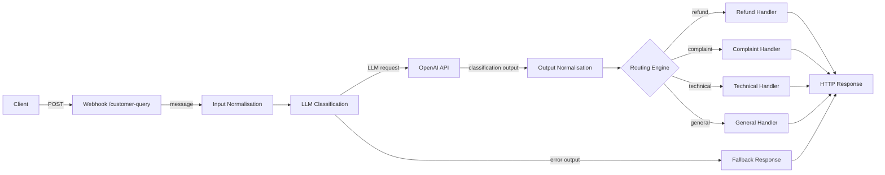

# AI Customer Support Orchestration Engine

Webhook-triggered n8n workflow that classifies inbound customer messages using GPT-3.5-turbo and routes them through a multi-branch automation pipeline with fault-tolerant error handling.

---

## Overview

This project implements an event-driven customer support triage system built entirely in n8n. Incoming support messages are received via a webhook endpoint, passed through an LLM classification layer, normalised, and conditionally routed to category-specific response handlers — all without human intervention in the loop.

The design prioritises deterministic output from the LLM, clean separation between classification and routing logic, and graceful degradation when the upstream API is unavailable.

---

## System Architecture


---

### Declarative Architecture (Mermaid)



---

### Architectural Notes

- **Event-driven entrypoint** via webhook enables synchronous API-style interaction  
- **LLM classification layer** enforces deterministic single-label output using prompt constraints  
- **Normalization stage** ensures routing stability (`trim + lowercase`)  
- **Routing engine** implemented as chained conditional evaluation (IF-node equivalent)  
- **Dedicated error path** isolates upstream API failures using `continueErrorOutput`  
- **Unified response layer** guarantees consistent output contract regardless of execution path

---

## Key Features

- **Event-driven trigger** — workflow activates on incoming HTTP POST via n8n webhook with synchronous response mode (`lastNode`)
- **LLM classification** — structured prompt engineering enforces single-word deterministic output from the model
- **Output normalisation** — LLM response is trimmed and lowercased before routing to prevent case-sensitivity failures
- **Multi-branch conditional routing** — chained IF nodes handle four distinct classification categories independently
- **Fault-tolerant error path** — HTTP node configured with `continueErrorOutput`, routing API failures to a dedicated fallback handler rather than crashing the workflow
- **Modular node design** — classification, normalisation, and routing are separated into discrete nodes, making each stage independently editable and debuggable

---

## Tech Stack

| Layer | Tool |
|---|---|
| Workflow orchestration | n8n |
| LLM classification | OpenAI API (`gpt-3.5-turbo`) |
| API transport | REST / HTTP Request node |
| Trigger | Webhook (POST) |
| Data format | JSON |

---

## Data Flow

1. **Webhook** receives a POST request containing a JSON body with a `message` field
2. **Set Message** extracts `$json.body.message` and passes it forward as a clean field
3. **Classify with OpenAI** sends the message to GPT-3.5-turbo with a system prompt instructing it to return exactly one of: `refund`, `complaint`, `technical`, `general`
4. **Set Category** pulls `choices[0].message.content` from the OpenAI response, applies `.trim().toLowerCase()` to normalise it
5. **Routing layer** evaluates the category through three chained IF nodes and directs execution to the matching response handler
6. **Response node** sets the `response` field, which the webhook returns synchronously to the caller

If the OpenAI call fails at step 3, execution is redirected via the error output to **Fallback Response**, which returns a safe default message.

---

## Example Usage

**Request:**
```bash
curl -X POST https://your-n8n-instance/webhook/customer-query \
  -H "Content-Type: application/json" \
  -d '{"message": "I want a refund for my order"}'
```

**Response:**
```json
{
  "response": "Your refund request has been received"
}
```

**Other classifications:**

| Input | Classified as | Response |
|---|---|---|
| `"I want a refund for my order"` | refund | Your refund request has been received |
| `"This service is absolutely terrible"` | complaint | Your complaint has been logged and will be reviewed within 24 hours |
| `"The app keeps crashing on login"` | technical | Our technical team has been notified and will be in touch shortly |
| `"I need help with my account"` | general | Your request has been received and forwarded to our support team |
| *(OpenAI unreachable)* | — | We're experiencing a technical issue. Please try again in a moment |

---

## Error Handling

The HTTP Request node is configured with `onError: continueErrorOutput`. Rather than halting execution on an API failure, n8n routes the item through a dedicated error output directly to the Fallback Response node. This ensures the webhook always returns a structured response to the caller regardless of upstream availability.

This is preferable to a try/catch pattern because it keeps error handling visible and editable at the workflow level, rather than buried in node configuration.

---

## Engineering Decisions

**Why a raw HTTP Request node instead of n8n's built-in OpenAI node?**
The HTTP Request node gives direct access to the full API response object, making it explicit where the data lives (`choices[0].message.content`) and easier to adapt if the response structure changes. It also makes the OpenAI dependency clearly visible in the workflow.

**Why `.trim().toLowerCase()` on the LLM output?**
LLMs don't always return exactly what the prompt specifies. Even with a strict system prompt, the model may return `"Refund"`, `" refund "`, or `"REFUND"`. Normalising the output before it hits the IF nodes prevents silent routing failures without needing to change the prompt.

**Why chained IF nodes instead of a Switch node?**
Each IF node is independently readable and debuggable. In n8n's canvas, chained IFs make the routing logic visible at a glance. A Switch node would consolidate this into one node but reduces transparency during debugging.

**Why `responseMode: lastNode` on the webhook?**
This makes the workflow behave like a synchronous API endpoint — the caller gets a response in the same HTTP connection rather than receiving a 200 acknowledgement and needing to poll for the result. Simpler for any client integrating against it.

---

## How to Run

**Requirements:** n8n (self-hosted or cloud), OpenAI API key

1. Clone the repo
2. In n8n, go to **Workflows → Import** and select `workflows/customer-support-orchestration-workflow.json`
3. Open the **Classify with OpenAI** node and replace `YOUR_OPENAI_API_KEY` with your actual key
4. Click **Activate** to enable the webhook
5. Send a POST request to your webhook URL

---

## Scalability Considerations

The current design processes one message per execution. To scale this for higher volume:

- Replace the webhook trigger with a queue-based trigger (e.g. pulling from a message queue or email inbox) to handle batched input
- Add a database logging node after each response handler to persist classification results
- Introduce a rate-limiting layer in front of the webhook if exposing it publicly
- Parameterise the OpenAI model in workflow settings so it can be swapped without editing the node directly

---

## Future Improvements

- **Database logging** — write each classification result to PostgreSQL or Airtable for audit trails and analytics
- **Webhook authentication** — add header-based token validation to prevent unauthorised access to the endpoint
- **Confidence scoring** — extend the prompt to return a confidence level alongside the category, and route low-confidence results to a human review queue
- **Email/Slack notifications** — trigger downstream notifications for high-priority categories such as complaints
- **Retry logic** — add retry handling on the HTTP node before falling back, to handle transient API failures gracefully
- **Containerised deployment** — package with Docker Compose for reproducible self-hosted deployment
